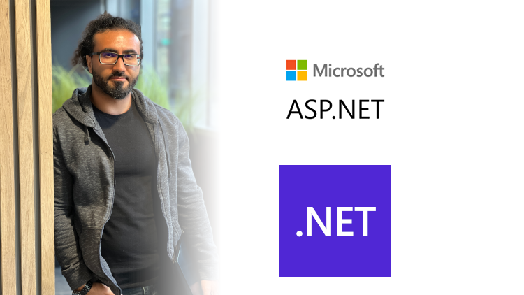

# ASP.NET Core for Backend: From beginners to deep dive

Welcome to the repository for the **[ASP.NET Core for Backend: From beginners to deep dive](https://www.udemy.com/course/aspnet-core-for-backend-from-beginners-to-deep-dive/?referralCode=0073C4808E6B13E1FDE2)** on Udemy.

<a href="https://www.udemy.com/course/aspnet-core-for-backend-from-beginners-to-deep-dive/?referralCode=0073C4808E6B13E1FDE2" target="_blank">

</a>

## 📚 About This Repo

This repository contains the source code used throughout the course. The `main` branch is intentionally left empty. Each project stage is organized into separate branches.

| Branch       | Description                                 |
|--------------|---------------------------------------------|
| `*-begin`      | Initial state of a lesson                   |
| `*-end`        | Completed code after a lesson               |

## 🚀 Getting Started

```bash
git clone https://github.com/denizkanmaz/turg-aspnet-api.git
```

## Maintainer

**Deniz Kanmaz**

Software Engineer | Course Author
